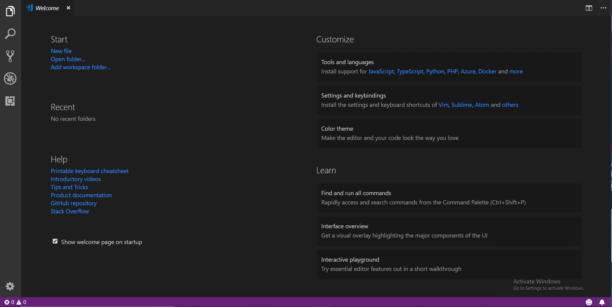
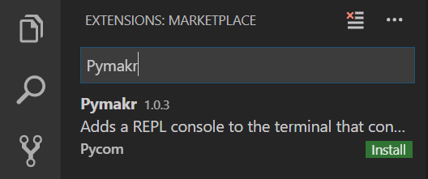
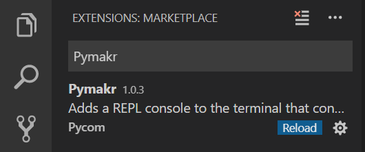
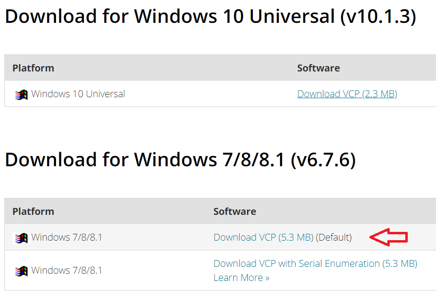
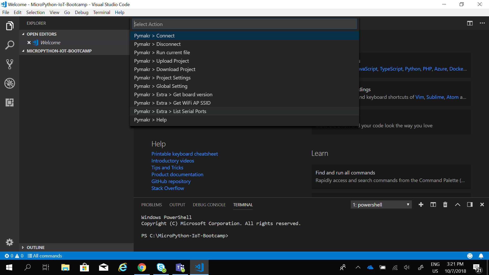
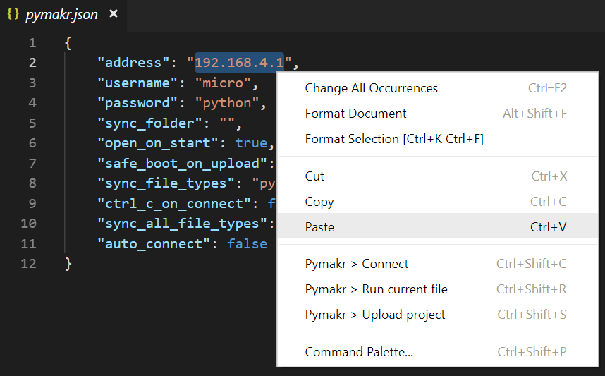

# Visual Studio Code
The first step is to download and install [Visual Studio Code] (https://code.visualstudio.com/) (if you already have it, skip to the next step).

After the download is done, click on the executable to install
Use the default settings (next, next, finish)

# Microsoft Python plugin

# NodeJS
You will also need NodeJS installed on your PC (it is a pre-requisite to the VS Code extension we will install next). Please download the latest LTS version available [from the NodeJS website.](https://nodejs.org/)

# Pymakr VSCode Extension

To install the Pymakr VSCode Extension open VSCode.

Navigate to the Extensions page, using the 5th button in the left navigation

Search for `Pymakr` and click the install button next to it.

Within a few minutes, a reload button should appear. Press it to reload VSCode.

That’s it! You’ve installed the Pymakr Extension for VSCode

# SiLabs CP2104 Driver
Download and install the SiLabs CP2104 Driver. Use the Default version.
Do NOT use the Windows 10 Universal (v10.1.1) driver! If you happen to download the universal version, you may need to manually revert to 6.7.6 on a regular basis as Windows will repeatedly use the newer, incorrect driver after each Windows update.

 | 

After download, unzip the file and run the appropriate version according:
CP210xVCPInstaller_x86.exe for 32 bit
CP210xVCPInstaller_x64.exe for 64 bit
Complete the install wizard by accepting the license agreement and with the default settings (next, next, finish)

https://m5stack.readthedocs.io/en/latest/get-started/establish_serial_connection.html

## Connecting via Serial USB

After installing the Pymakr Plugin, you need to take a few seconds to configure it for first time use. Please follow these steps:

1. Connect your M5Stack device to your computer via USB. 
2. Open Visual Studio Code and check if the Pymakr Plugin has correctly installed. If you get an error NodeJS is missing, reboot youy computer and try again.

3. Click `All commands` on the bottom of the Visual Studio Code window and in the list that appears, click `Pymakr > Extra > List Serial Ports`. This will list the available serial ports. If Pymakr is able to auto-detect which to use, this will be copied to your clipboard. If not please manually copy the correct serial port.

4. Once again click `All commands`, then click `Pymakr > Global Settings`. This will open a JSON file. Paste the serial address you copied earlier into the field `address` and save the file. Finally close and save the JSON file, click `All commands`, then `Pymakr > Connect` to connect your device. The Pymakr console should show three arrows `>>>`, indicating that you are connected.

These settings can also be applied on a per project basis by clicking `All commands` then `Pymakr > Project Settings`. This will open a JSON file which you can edit to enter your desired settings for the currently open project.


This process is easiest with either a Pycom Expansion Board or a Pytrack/Pysense as the addresses are automatically selected. For external products such as FTDI USB Serial Cables, the serial address may need to be copied manually. Additionally, the reset button on the device may also need to be pressed before a connection message appears.


## Connecting via Telnet

After installing the Pymakr Plugin, a device may be connected via the telnet interface. Please see the following steps:

1. Ensure that Pycom device is turned on
2. Connect the host computer to the WiFi Access Point named after your board

   \(the SSID will be as follows e.g. `lopy-wlan-xxxx`, `wipy-wlan-xxxx`, etc.\).

   The password is `www.pycom.io`.

3. Follow the steps as above in the "Connecting via Serial USB" section but

   enter `192.168.4.1` as the address.

4. The default username and password are `micro` and `python`,

   respectively.

5. Finally close the JSON file, click `All commands`, then `Pymakr > Connect`,

   Pymakr will now connect via telnet.
